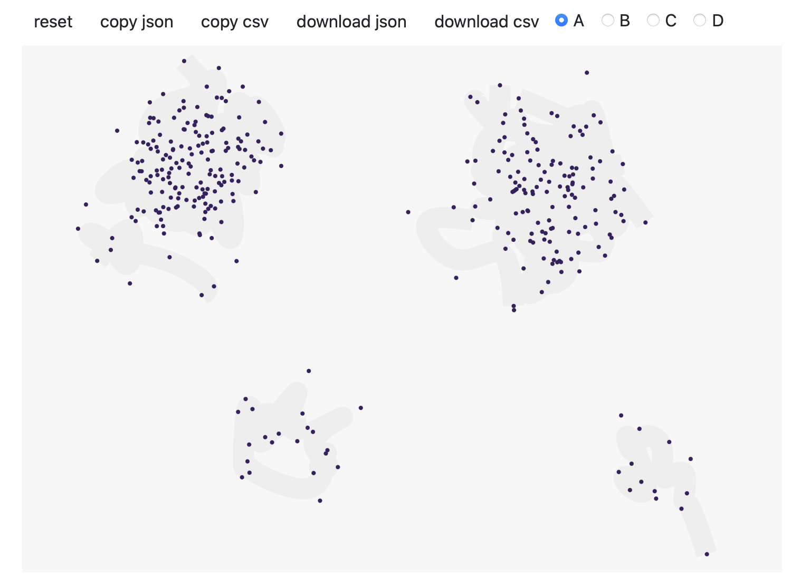
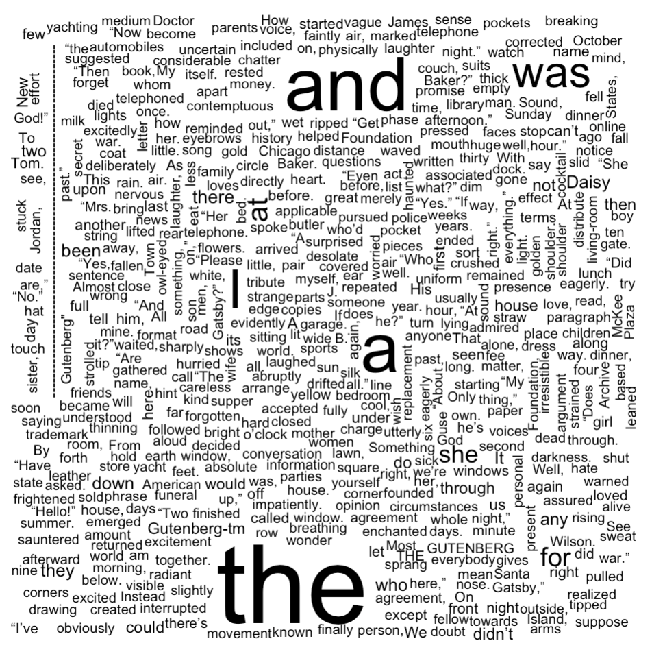
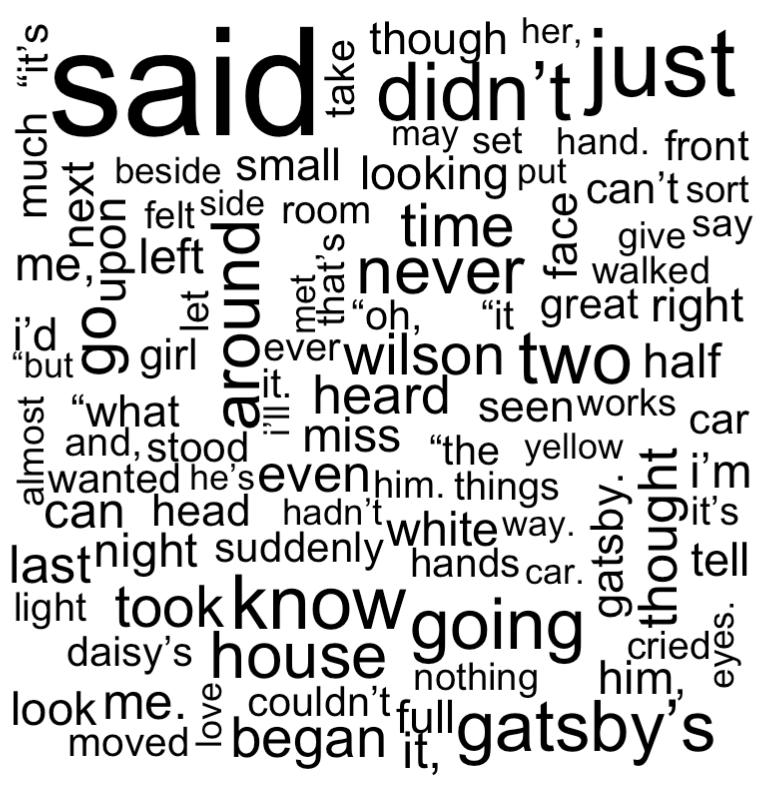

```{r xaringan-themer, include=FALSE, warning=FALSE}
library(xaringanthemer)
style_mono_accent(
  base_color = "#1c5253",
  header_font_google = google_font("Poppins"),
  text_font_google   = google_font("Roboto", "300", "300i"),
  code_font_google   = google_font("Fira Mono"),
  title_slide_text_color = "#1c5253",
  title_slide_background_color = "#ffffff"
)

# build_pdf("slides.Rmd", complex_slides = TRUE, partial_slides = TRUE)
```

```{css, echo=FALSE}
.lightblue {
  background-color: lightblue !important;
  color: black !imporant;
  font-weight: normal !important;
}
```

```{r setup, include=FALSE}
options(htmltools.dir.version = FALSE)
knitr::opts_chunk$set(comment="")
```

```{r prelim, echo=FALSE, message=FALSE, warning=FALSE}
library(lubridate)
library(gplots)
library(knitr)
library(Quandl)
library(sf)
library(geojsonio)
library(tidyverse)
library(rmapshaper)
library(paletteer)
```

---
# Clustering

- Group similar data items together

- Exploratory data analysis / pattern recognition

- Example of _unsupervised learning_ (a branch of ML)

---
class: smaller
# Simulated dataset

- I used [Calm Code](https://calmcode.io/labs/drawdata.html) to simulate a dataset demonstrating clustering

```{r, out.width = "80%", echo=FALSE}

```

---
class: smaller
# Simulated dataset

```{r, dpi=600, fig.width=5, fig.height=2, eval=TRUE}
data = read.csv('data.csv')
library(ggplot2)
ggplot(data, aes(x = x, y = y)) + 
  theme_classic() + 
  geom_point()
```

---
# k-means clustering

The simplest clustering method is k-means clustering

- Iterative method with random initialization

- The parameter is fixed: the number of clusters _k_

---
class: smaller
# k-means clustering in 2D

- Step 1: Randomly assign each data item to one of the _k_ clusters

```{r, dpi=600, fig.width=5, fig.height=2, eval=TRUE}
N = dim(data)[1]; K = 4; set.seed(240)
cluster = sample(K, size = N, replace = TRUE)
data$cluster = cluster
p = ggplot(data, aes(x = x, y = y, color = as.factor(cluster))) + labs(color = "cluster") + theme_classic() + geom_point()
print(p)
```

---
class: smaller
# k-means clustering in 2D

- Step 2: Compute the mean _x_ and _y_ coordinate of each cluster (this is called a centroid)

- If a cluster is empty, assign the corresponding centroid to a randomly selected data item

```{r, dpi=600, fig.width=5, fig.height=2, eval=FALSE}
mus = matrix(NA, K, 3)
colnames(mus) = c("x", "y", "cluster")
for (k in 1:K) {
  mus[k, 1] = mean(data$x[data$cluster == k])
  mus[k, 2] = mean(data$y[data$cluster == k])
  mus[k, 3] = k
}
q = p + geom_point(as.data.frame(mus), mapping = aes(x = x, y = y, color = as.factor(cluster)), shape=4, stroke = 1) + theme(legend.position = "none")
print(q)
```

---
class: smaller
# k-means clustering in 2D

- Step 2:

```{r, dpi=600, fig.width=5, fig.height=2, eval=TRUE, echo=FALSE}
mus = matrix(NA, K, 3)
colnames(mus) = c("x", "y", "cluster")
for (k in 1:K) {
  mus[k, 1] = mean(data$x[data$cluster == k])
  mus[k, 2] = mean(data$y[data$cluster == k])
  mus[k, 3] = k
}
q = p + geom_point(as.data.frame(mus), mapping = aes(x = x, y = y, color = as.factor(cluster)), shape=4, stroke = 1) + theme(legend.position = "none")
print(q)
```

---
class: smaller
# k-means clustering in 2D

- Step 3: Reassign each data item to the cluster with the closest centroid

```{r, dpi=600, fig.width=5, fig.height=2, eval=TRUE,message=FALSE}
library(flexclust)
d = dist2(data[, 1:2], mus[, 1:2])
for (n in 1:N) { data$cluster[n] = which.min(d[n, ]) }
p = ggplot(data, aes(x = x, y = y, color = as.factor(cluster))) + labs(color = "cluster") + theme_classic() + geom_point()
print(p)
```

---
class: smaller
# k-means clustering in 2D

- Iterate by repeating steps 2 and 3 until a stopping condition is met

- Examples of stopping conditions:

1. A maximum number of iterations is reached

2. The cluster assignment doesn't change

3. The centroids move by only a small amount


---
class: smaller
# k-means clustering in 2D

- The result may look something like this:

```{r, dpi=600, fig.width=5, fig.height=2, eval=TRUE,message=FALSE}
set.seed(240)
result = kmeans(data[, 1:2], 4, iter.max = 100)
data$cluster = result$cluster
p = ggplot(data, aes(x = x, y = y, color = as.factor(cluster))) + labs(color = "cluster") + theme_classic() + geom_point()
print(p)
```

---
class: smaller
# k-means theory

- The k-means algorithm is one of the simplest clustering algorithms

- A big drawback is that you have to already know how many clusters you want

- Another drawback is that the "variance" of each cluster is the same: A cluster that is very compact might have a k-means solution that includes aspects of other clusters

---
class: smaller
# k-means theory

- Another drawback is that k-means clustering doesn't work for "convex" clusters

---
# String manipulation

- Natural language processing (NLP)

    - Sentiment analysis
    
    - Chatbots, translation
    
    - Electronic healthcare records ...

- Preprocessing data sources

    - Normalization of factors
    
    - Parsing websites or documents ...
    
- Data analysis

    - Understanding DNA ...

---
# String manipulation

We'll review string manipulation in base R. First, we will read the text of the Great Gatsby (Fitzgerald 1925) into a single string variable

```{r}
fn = "gatsby.txt"
s = readChar(fn, file.info(fn)$size)
nchar(s) # Print number of characters in text
```

---
# String manipulation

- We want a character vector with one word per element

```{r}
x = strsplit(s, '\\s+')
x = unlist(x)
print(x[507:517])
```

---
# Wordclouds

- We can create a wordcloud of the document (visualization)

```{r, eval=FALSE}
library(wordcloud)
t = table(x)
wordcloud(names(t), t)
```

.center[
```{r, out.width = "40%", echo=FALSE}

```
]

---
# Wordclouds

- In NLP, we often ignore "stopwords" such as "a" and "the". Here, we also ignore infrequent words

```{r}
library(stopwords)
x = tolower(x)
x = x[!(x %in% stopwords("en"))]
t = table(x)
t = t[t >= 20]
```

.center[
```{r, out.width = "30%", echo=FALSE}

```
]


---
class: smaller
# Low level string manipulation

Easiest R package: _stringr_

- Match a string and extract it _str_extract_

- Detect a matching string _str_detect_

- Replace one string with another _str_replace_

- Split a string on a substring _str_split_

---
# Strings: extracting

```{r}
a = c("apples x4", "bag of flour", "bag of sugar", "milk x2")
str_extract(a, "\\d")
str_extract(a, "[a-z]+")
```

---
# Strings: detecting

```{r}
a = c("apple", "banana", "pear", "pineapple")
str_detect(a, "a")
str_detect(a, "^a")
```

---
# Strings: replacing

```{r}
a = c("one apple", "two pears", "three bananas")
str_replace(a, "[aeiou]", "-")
str_replace_all(a, "[aeiou]", "-")
```

---
# Strings: splitting

```{r}
a = c("apples and oranges and pears and bananas",
  "pineapples and mangos and guavas")
str_split(a, " and ")
str_split(a, "\\s+")
```

---
# Reading

- Munzert Section 8.2